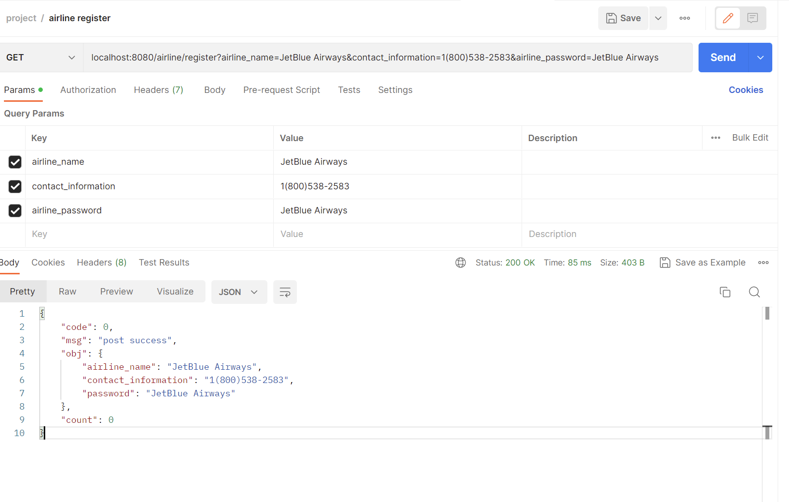
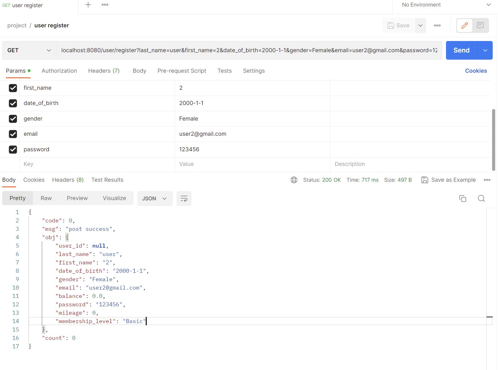
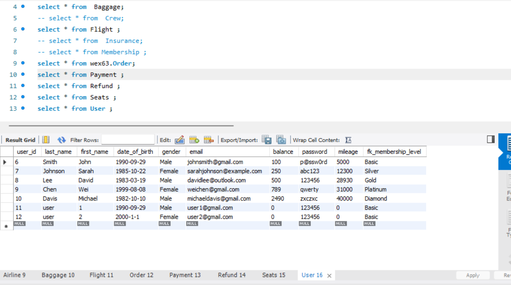
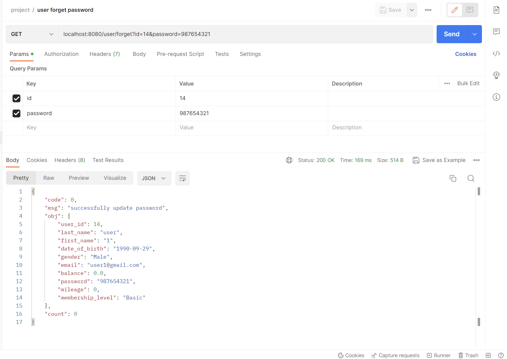
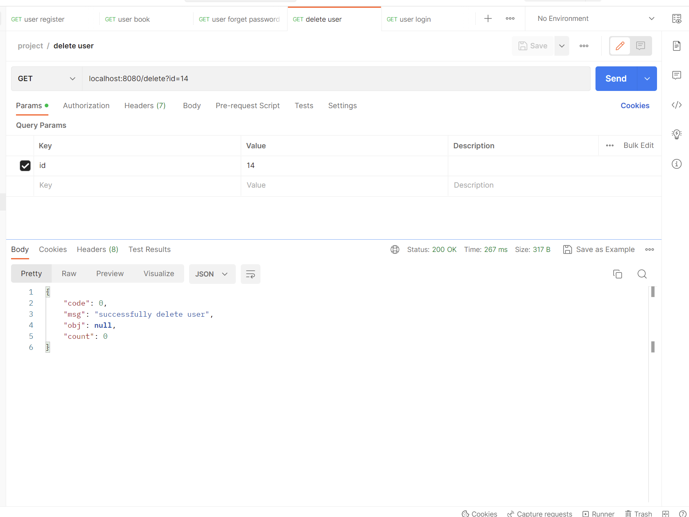
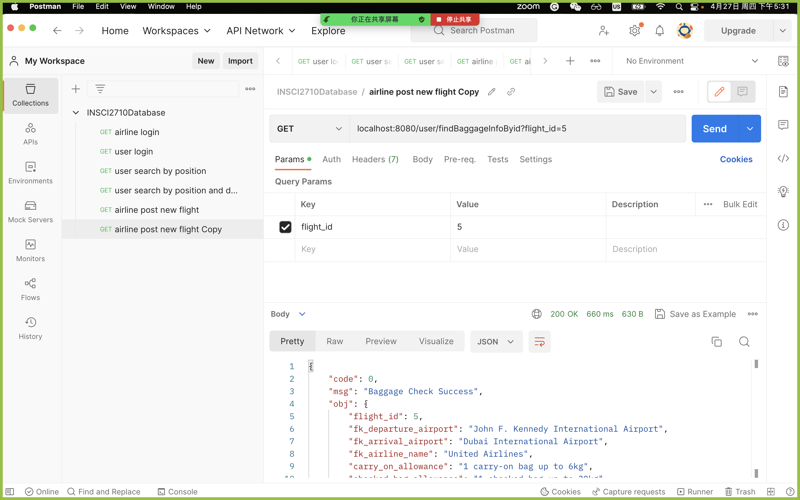

# Ticket Booking System
## Introduction
This is a course project for INFSCI 2710 Database Management Systems
project link: https://github.com/Xhy-5000/ticket-booking-system

## Setup
- Run src/main/java/project.ticketbookingsystem/TicketBookingSystemApplication(aka main function)

- Open postman
- Start a new request in a new collection and **add Content-Type=application/json in Headers**

## Test Details
### airline login
localhost:8080/airline/login?name=United Airlines&password=United Airlines


### airline register
localhost:8080/airline/register?airline_name=JetBlue Airways&contact_information=1(800)538-2583&airline_password=JetBlue Airways


### user login
localhost:8080/login?id=6&password=p@ssw0rd


### user register
localhost:8080/user/register?last_name=user&first_name=2&date_of_birth=2000-1-1&gender=Female&email=user2@gmail.com&password=123456

Then the info of this new user would be added into the database.


### user forget password
localhost:8080/user/forget?id=14&password=987654321


### close account
localhost:8080/delete?id=14


### user search by position
localhost:8080/user/search?departure_airport=John F. Kennedy International Airport&arrival_airport=Pittsburgh Internetional Airport


### user search by position and date
localhost:8080/user/searchDate?departure_airport=John F. Kennedy International Airport&arrival_airport=Pittsburgh Internetional Airport&date=2023-05-05


### airline post new flight
localhost:8080/airline/post?departure_airport=John F. Kennedy International Airport&arrival_airport=Pittsburgh Internetional Airport&airline_name=United Airlines&departure_time=2023-05-10 17:00:00&arrival_time=2023-05-10 19:40:00&flight_duration=2h 40m&wifi=0&charge=0&in_flight_entertainment=0&meal=0


### user check baggage information
localhost:8080/user/findBaggageInfoByid?flight_id=5



## Data Type
The return value is like 
```aidl
{
    "code": 0, # 0 means success, 1 means error
    "msg": "successfully login", # message
    "obj": { # object in this function
        "airline_name": "United Airlines",
        "contact_information": "1(800)864-8331",
        "password": "United Airlines"
    },
    "count": 0
}
```