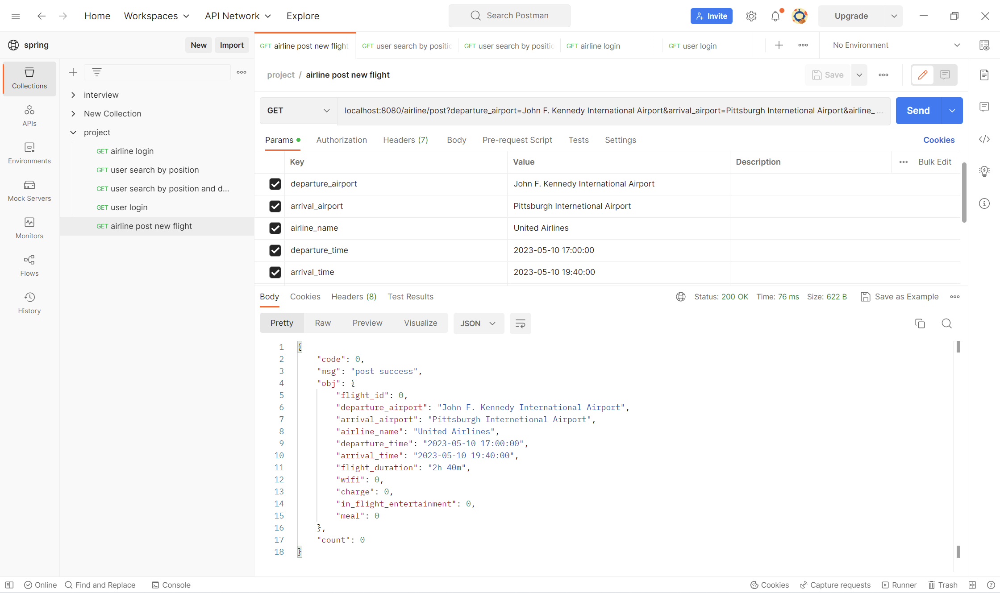

# Ticket Booking System
## Introduction
This is a course project for INFSCI 2710 Database Management Systems
project link: https://github.com/Xhy-5000/ticket-booking-system

## Setup
- Run src/main/java/project.ticketbookingsystem/TicketBookingSystemApplication(aka main function)

- Open postman
- Start a new request in a new collection and **add Content-Type=application/json in Headers**

## Test details
### airline login
localhost:8080/airline/login?name=United Airlines&password=United Airlines

### user login
localhost:8080/login?id=6&password=p@ssw0rd

### user search by position
localhost:8080/user/search?departure_airport=John F. Kennedy International Airport&arrival_airport=Pittsburgh Internetional Airport

### user search by position and date
localhost:8080/user/searchDate?departure_airport=John F. Kennedy International Airport&arrival_airport=Pittsburgh Internetional Airport&date=2023-05-05

### airline post new flight
localhost:8080/airline/post?departure_airport=John F. Kennedy International Airport&arrival_airport=Pittsburgh Internetional Airport&airline_name=United Airlines&departure_time=2023-05-10 17:00:00&arrival_time=2023-05-10 19:40:00&flight_duration=2h 40m&wifi=0&charge=0&in_flight_entertainment=0&meal=0
